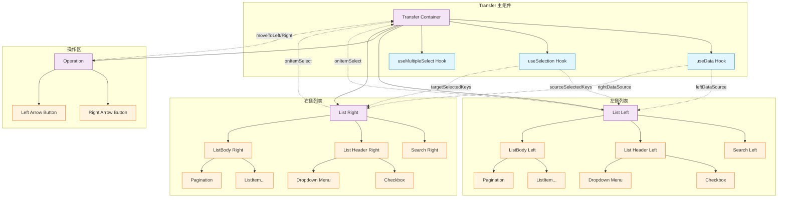
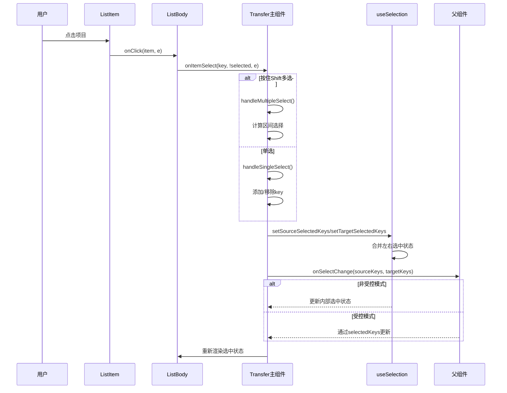
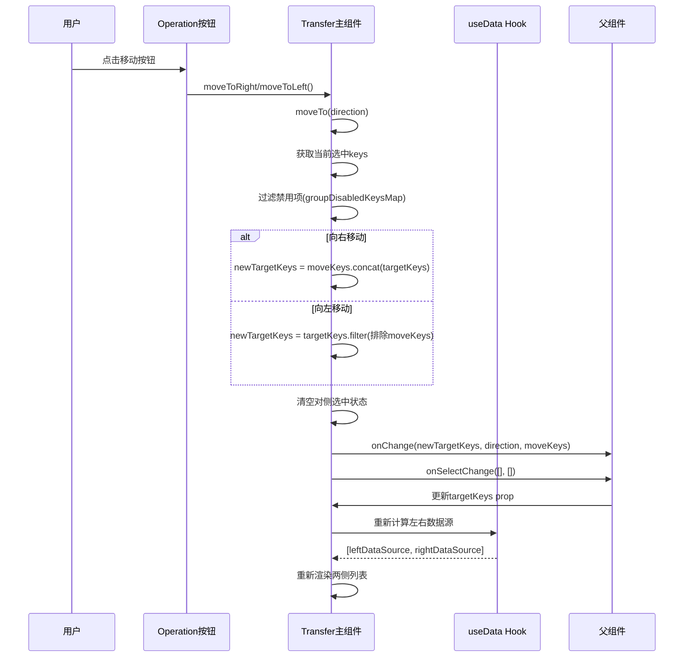
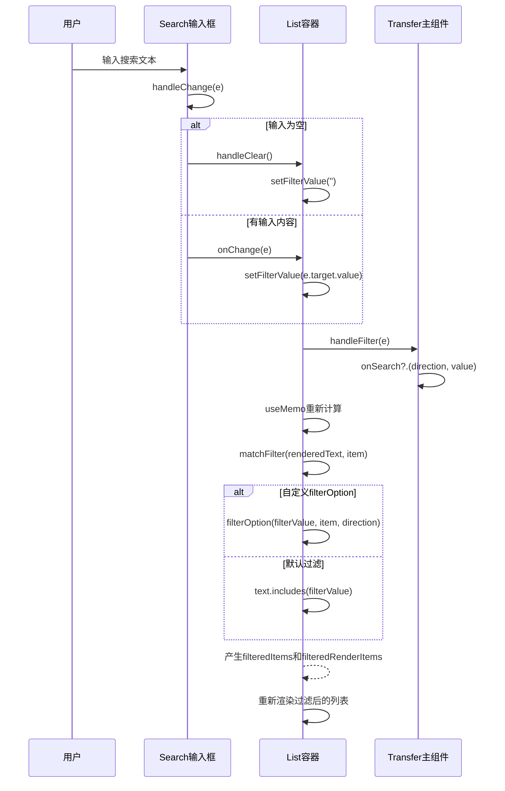
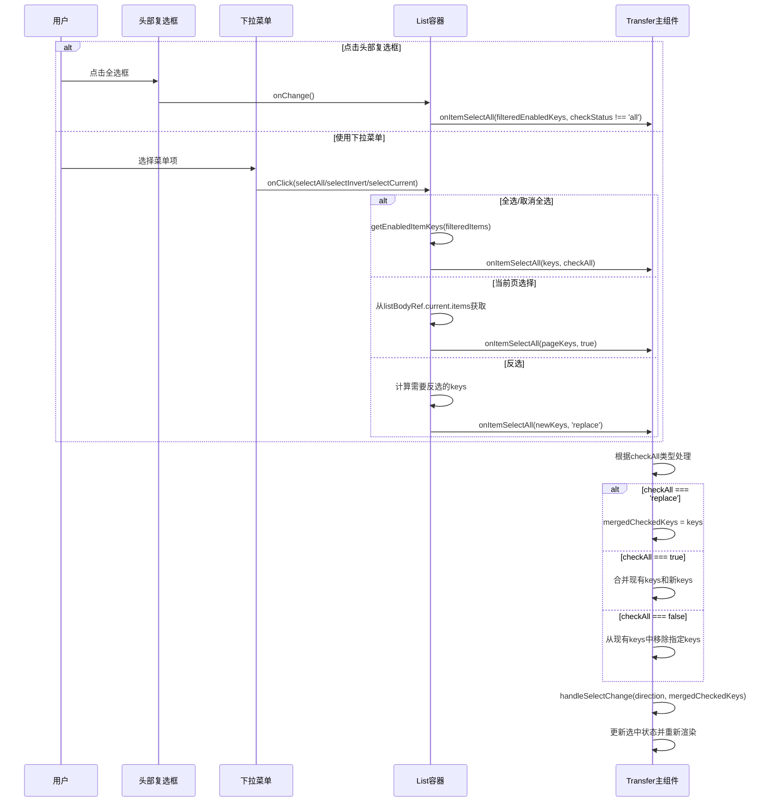
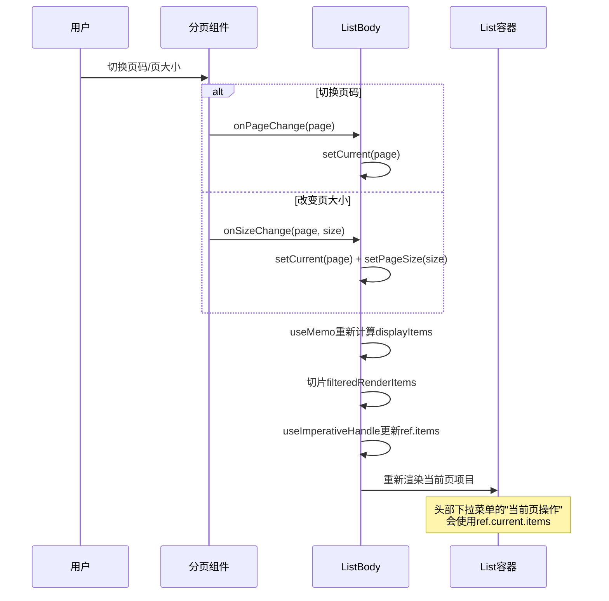

### Transfer 穿梭框组件源码解析（Ant Design）

> 适用范围：antd v5 源码。本文面向需要理解组件内部架构、数据流、关键交互与可扩展点的工程师。

## 1. 组件定位与结构概览

- **组件职责**：在左右两侧列表间移动项，支持筛选、全选/反选、分页、一键移除、受控/非受控选择、国际化与无障碍方向（RTL）。
- **核心文件**：
  - `components/transfer/index.tsx`：顶层容器，协调数据、状态与两个列表 + 操作区
  - `components/transfer/list.tsx`：单侧列表容器（头部 + 搜索 + 列表主体 + 页脚）
  - `components/transfer/ListBody.tsx`：列表主体（渲染项、分页、滚动、移除）
  - `components/transfer/operation.tsx`：中间操作按钮（左右移动）
  - `components/transfer/search.tsx`：搜索输入（带清空）
  - `components/transfer/hooks/useData.ts`：将 `dataSource` 拆分为左右数据、保证右侧按 `targetKeys` 顺序
  - `components/transfer/hooks/useSelection.ts`：维护左右选中 keys 的合并受控状态

### 1.1 组件架构图



## 2. 数据模型与关键类型

- `TransferItem`：数据项结构（`key?`、`title?`、`description?`、`disabled?`，以及扩展字段）
- `TransferKey`：项主键类型
- `KeyWise<T>`：为记录补齐 `key` 字段
- `TransferDirection`：`'left' | 'right'`
- `TransferLocale`：标题、占位与菜单文案等
- `PaginationType`：分页配置（或布尔）

## 3. 顶层容器 Transfer 的职责

文件：`components/transfer/index.tsx`

- **前缀与样式**：通过 `ConfigContext` 获取 `prefixCls`、`direction`、主题 `useStyle`，并合并表单态 `status`、`hasFeedback`。
- **数据拆分**：`useData(dataSource, rowKey, targetKeys)` 返回：
  - `mergedDataSource`：如提供 `rowKey`，为每条记录补齐 `key`
  - `leftDataSource`：未在 `targetKeys` 中的记录（保持 `dataSource` 顺序）
  - `rightDataSource`：在 `targetKeys` 中的记录（按 `targetKeys` 顺序）
- **选择状态**：`useSelection(left, right, selectedKeys)` 将左右列表的选中合并维护：
  - 支持受控 `selectedKeys`
  - 自动剔除不在当前数据源的 key
  - 提供 `setSourceSelectedKeys`、`setTargetSelectedKeys`
- **多选（Shift）**：`useMultipleSelect` 支持按住 Shift 连续选择，内部通过“上次选择索引”实现区间选中。
- **移动逻辑 `moveTo(direction)`**：
  - 过滤禁用项（`groupDisabledKeysMap`）
  - 计算新的 `targetKeys`：向右为追加，向左为排除
  - 清空对侧选中并回调 `onChange(newTargetKeys, direction, moveKeys)`
- **批量选择 `onItemSelectAll`**：支持追加/删除/替换（`'replace'`）三种模式，底层使用 `groupKeysMap` 做集合运算。
- **搜索联动**：左右分别透传 `onSearch('left' | 'right', value)`；清空时传空串。
- **渲染**：
  - 左右各渲染一个 `List`，传入侧向、数据、选择、搜索、全选菜单、分页、图标等
  - 中间渲染 `Operation`（左右移动按钮），支持 `oneWay` 只显示单向按钮

## 4. 列表容器 List 的职责

文件：`components/transfer/list.tsx`

- **本地过滤状态**：内部维护 `filterValue`，支持受控初值 `showSearch.defaultValue`；`Search` 为空时会触发 `handleClear`。
- **渲染管线**：
  1) `render(item)` → `RenderedItem`（`renderedText`/`renderedEl`），支持 plain object `{ label, value }`
  2) 文本匹配：若 `props.filterOption` 存在，则优先使用；否则 `renderedText.includes(filterValue)`
  3) 产出 `filteredItems` 与 `filteredRenderItems`
- **勾选状态推导**：
  - `checkedActiveItems`：已过滤且选中的可用项
  - `checkStatus`：'none' | 'part' | 'all'，用于头部复选框 `checked/indeterminate`
- **头部区域**：
  - 复选框：切换时仅对“已过滤且可用”的项执行全选/全不选
  - 下拉菜单 `Dropdown`：
    - 非 `showRemove`：提供“全选 / 当前页全选（分页时）/ 反选”等
    - `showRemove` 开启（通常右侧单向场景）：提供“移除当前页 / 移除全部”
  - `getSelectAllLabel`：动态显示“已选/总数 + 单位”的摘要，或自定义 `selectAllLabel`
- **主体区域**：
  - 通过 `renderListBody` 渲染：
    - 若外部自定义 `renderList`，包裹在 `-body-customize-wrapper` 容器内
    - 否则渲染 `DefaultListBody`（即 `ListBody.tsx`）
  - 支持 `notFoundContent`（支持数组形式按左右分开）
- **分页与移除**：`showRemove` 与 `pagination` 会影响下拉菜单项，页内数据来自 `ListBody` 的 `ref.current.items`

## 5. 列表主体 ListBody 的职责

文件：`components/transfer/ListBody.tsx`

- **分页解析**：`parsePagination` 合并默认配置（`simple`、`showSizeChanger=false`、`showLessItems=false`）
- **页码与 pageSize**：
  - `current` 本地维护；`pageSize` 支持受控值
  - 过滤结果变化时，自动 clamp 当前页到最大页
- **事件**：
  - 点击项：`onItemSelect(key, !selected, e)`
  - 移除单项（右侧/单向）：`onItemRemove([key])`
  - 滚动：向上传递 `onScroll`
- **渲染项**：`ListItem`（接收 `renderedEl`、`renderedText`、`checked`、`disabled`、`showRemove` 等）
- **对外暴露**：`useImperativeHandle(ref, { items })` 暴露当前页展示的 `RenderedItem[]`，供头部“当前页操作”使用

## 6. 操作区 Operation 的职责

文件：`components/transfer/operation.tsx`

- 两个主按钮（主色、small 尺寸）：
  - 向右：`disabled || !rightActive` 时禁用
  - 向左：仅非 `oneWay` 时渲染，`disabled || !leftActive` 时禁用
- 图标方向支持 RTL

## 7. 搜索框 Search 的职责

文件：`components/transfer/search.tsx`

- 基于 `Input`，带 `allowClear` 与放大镜 `prefix`
- `onChange` 回调后，当值为空字符串时会触发 `handleClear`，与 `List` 内部本地状态保持同步

## 8. 选择与移动的完整数据流

1) 用户在某侧点击项：
   - `ListBody` → 调用 `onItemSelect(key, checked, e)`
   - `index.tsx/onItemSelect`：根据 `multiple`（Shift）决定单项/区间选择 → 产生新的 holderSet → 同步 `onSelectChange` 回调 → 若非受控 `selectedKeys` 则更新内部合并选择状态

2) 用户点击"移动到右侧/左侧"：
   - `Operation` → `moveTo('right'|'left')`
   - 过滤禁用项 → 计算新的 `targetKeys` → 清空对侧选择 → 回调 `onChange(newTargetKeys, direction, moveKeys)`

3) 用户使用"全选/反选/当前页选择/反选"菜单：
   - `List` 根据 `filteredItems` 与当前页 `ref.items` 计算目标 keys
   - 调 `onItemSelectAll(keys, checkAll|'replace')` → 合并或替换当前选中集合

4) 搜索：
   - `Search` 触发 `onChange` 与可能的 `handleClear`
   - `List` 以本地 `filterValue` 与 `filterOption` 决定 `filteredItems`

### 8.1 交互时序图

#### 单项选择流程



#### 项目移动流程



#### 搜索过滤流程



#### 全选/反选流程



#### 分页交互流程



### 8.2 状态管理数据流图

```mermaid
graph TD
    subgraph "外部 Props"
        A1[dataSource]
        A2[targetKeys]
        A3[selectedKeys]
        A4[onChange]
        A5[onSelectChange]
    end

    subgraph "内部 Hooks"
        B1[useData]
        B2[useSelection]
        B3[useMultipleSelect Left]
        B4[useMultipleSelect Right]
    end

    subgraph "计算状态"
        C1[mergedDataSource]
        C2[leftDataSource]
        C3[rightDataSource]
        C4[sourceSelectedKeys]
        C5[targetSelectedKeys]
    end

    subgraph "List 本地状态"
        D1[filterValue Left]
        D2[filterValue Right]
        D3[filteredItems Left]
        D4[filteredItems Right]
        D5[checkStatus Left]
        D6[checkStatus Right]
    end

    subgraph "ListBody 本地状态"
        E1[current Left]
        E2[pageSize Left]
        E3[current Right]
        E4[pageSize Right]
        E5[memoizedItems Left]
        E6[memoizedItems Right]
    end

    A1 --> B1
    A2 --> B1
    A3 --> B2

    B1 --> C1
    B1 --> C2
    B1 --> C3

    B2 --> C4
    B2 --> C5

    C2 --> D3
    C3 --> D4
    C4 --> D5
    C5 --> D6

    D1 --> D3
    D2 --> D4

    D3 --> E5
    D4 --> E6

    E1 --> E5
    E2 --> E5
    E3 --> E6
    E4 --> E6

    C4 -.->|onSelectChange| A5
    C5 -.->|onSelectChange| A5
    C2 -.->|onChange| A4
    C3 -.->|onChange| A4

    classDef propsStyle fill:#ffebee,stroke:#c62828
    classDef hooksStyle fill:#e8f5e8,stroke:#2e7d32
    classDef computedStyle fill:#e3f2fd,stroke:#1565c0
    classDef localStyle fill:#fff8e1,stroke:#ef6c00
    classDef paginationStyle fill:#fce4ec,stroke:#ad1457

    class A1,A2,A3,A4,A5 propsStyle
    class B1,B2,B3,B4 hooksStyle
    class C1,C2,C3,C4,C5 computedStyle
    class D1,D2,D3,D4,D5,D6 localStyle
    class E1,E2,E3,E4,E5,E6 paginationStyle
```



## 9. 关键可扩展点

- `render(item)`：自定义每项的渲染；返回字符串、ReactNode，或 `{ label, value }`（value 用于搜索匹配）
- `children`（`renderList`）：完全自定义列表主体（仍会包裹在容器以适配布局）
- `footer(props, { direction })`：自定义列表底部
- `filterOption(input, item, direction)`：接管筛选逻辑
- `rowKey(record)`：为数据自定义 `key` 生成
- `selectAllLabel` / `selectAllLabels`：自定义头部“已选/总数”显示
- `pagination`：布尔或对象，结合 `ListBody` 的当前页暴露能力实现“当前页操作”
- `selectionsIcon`：自定义头部下拉触发图标

## 10. 受控与非受控策略

- `selectedKeys` 受控：由外部完全控制所选 keys，组件内部仅回调 `onSelectChange`
- 非受控：内部通过 `useSelection` 维护合并选中状态
- `targetKeys` 一般受控：移动后通过 `onChange` 通知外部更新（或在外部保持受控）

## 11. 国际化与方向

- 文案来源：
  - `useLocale('Transfer', defaultLocale.Transfer)` 获取默认上下文
  - 通过 `getLocale` 合并 `renderEmpty('Transfer')` 与 `props.locale`
- RTL：`dir === 'rtl'` 时，列表方向与箭头图标自动调整

## 12. 性能与可维护性

- 广泛使用 `useMemo`/`useCallback` 以避免重复计算与不必要渲染
- 将数据拆分、选择、列表渲染、操作区等职责清晰分层，便于维护
- 通过 Map/Set 的集合运算（`groupKeysMap` 等）提升选择操作效率

## 13. 易错点与边界处理

- 保证 `rowKey` 稳定，避免 key 抖动导致选中异常
- 过滤条件变化时，头部全选仅对“已过滤且可用”的项生效
- 分页场景下，“当前页操作”依赖 `ListBody` 通过 `ref` 暴露的 `items`
- `oneWay` 模式下右侧提供“移除”菜单而非复选菜单
- 受控 `selectedKeys` 时，内部不会主动 setState，需要外部同步回传

## 14. 最小示例（API 侧重点）

```tsx
<Transfer
  dataSource={data}
  targetKeys={targetKeys}
  selectedKeys={selectedKeys}
  onChange={(nextTargetKeys, direction, moveKeys) => {}}
  onSelectChange={(leftKeys, rightKeys) => {}}
  render={(item) => ({ label: <span>{item.title}</span>, value: item.title || '' })}
  showSearch={{ placeholder: '搜索', defaultValue: '' }}
  filterOption={(input, item) => (item.title || '').includes(input)}
  footer={(listProps, info) => <div>Footer - {info?.direction}</div>}
  selectAllLabels={[nodeA, nodeB]}
  oneWay
  pagination={{ pageSize: 10 }}
/>
```

## 15. 变更/扩展建议（可选）

- 如需跨页“全选/反选”，可在上层维度引入“全局过滤 key 集合”并透传给 `onItemSelectAll('replace')`
- 大数据量场景可考虑虚拟列表替换 `ListBody` 的渲染（通过 `children` 自定义）
- 若要更灵活的搜索（如拼音/多字段），建议在 `filterOption` 内集中实现

—— 完 ——

