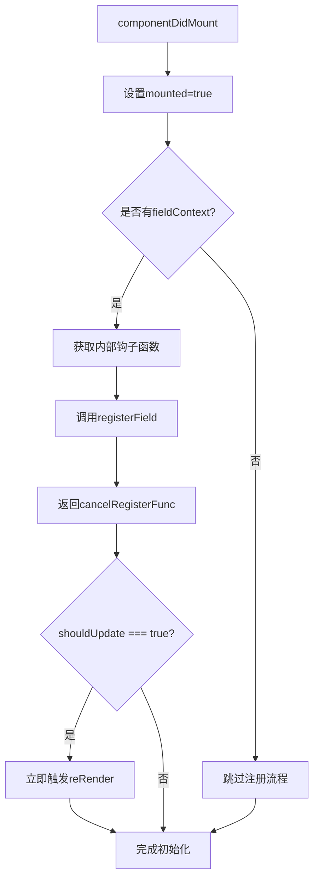
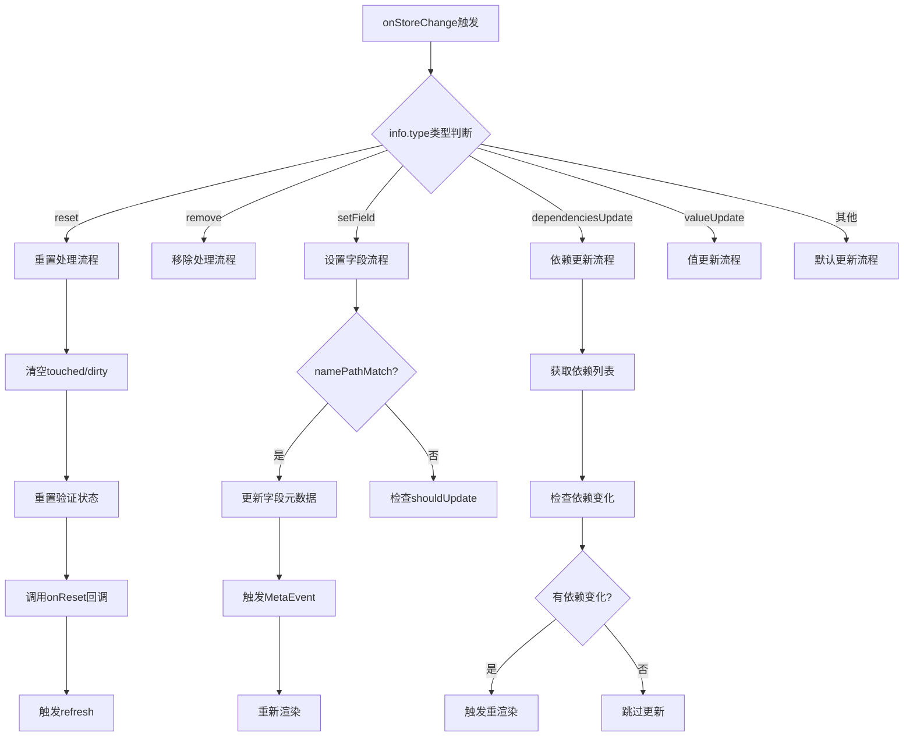
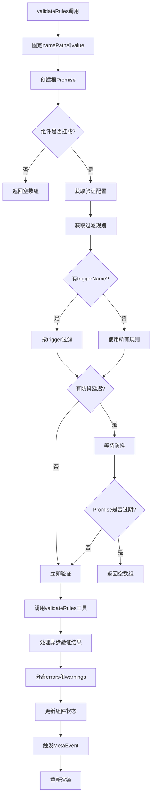
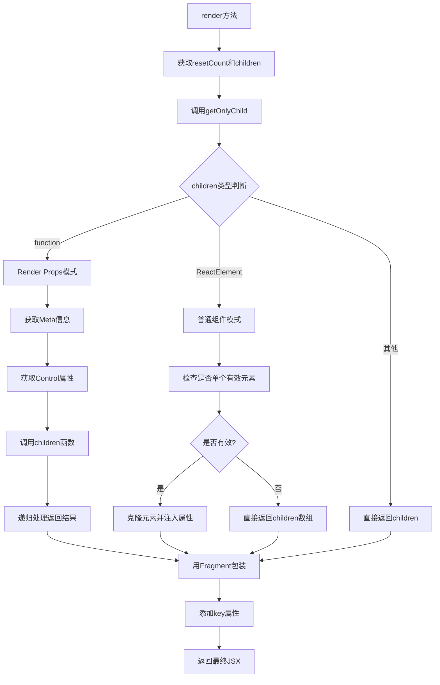
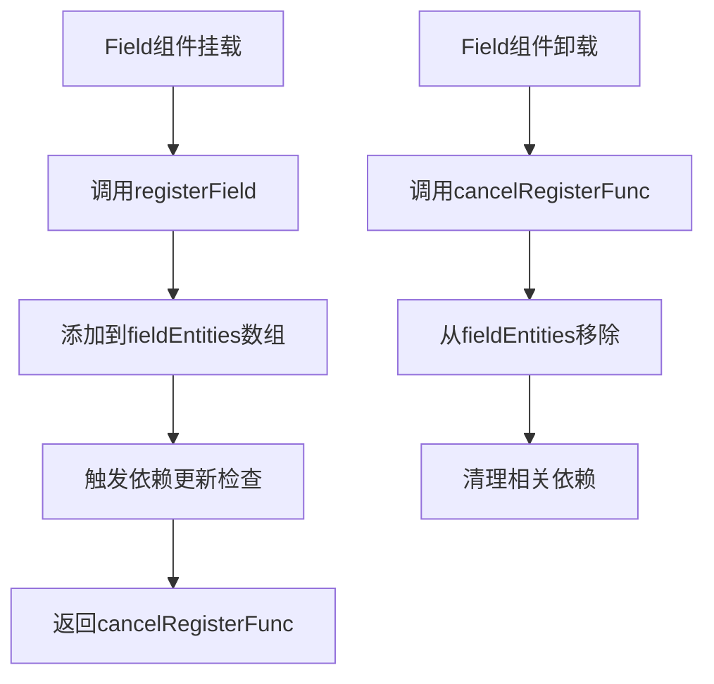
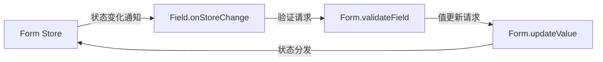

# Field 组件深度源码分析

## 目录
- [概述](#概述)
- [核心架构](#核心架构)
- [详细实现分析](#详细实现分析)
- [状态管理机制](#状态管理机制)
- [验证系统深度解析](#验证系统深度解析)
- [渲染机制详解](#渲染机制详解)
- [性能优化策略](#性能优化策略)
- [与Form的交互机制](#与form的交互机制)
- [实际应用场景](#实际应用场景)

## 概述

Field 组件是 field-form 表单库的核心组件，它不仅是一个简单的表单字段包装器，更是一个完整的状态管理、验证处理、事件分发的综合性组件。它采用 Class 组件实现，通过实现 `FieldEntity` 接口与 Form 组件进行深度集成。

### 设计理念

1. **单一职责原则**: 每个 Field 只管理一个表单字段的完整生命周期
2. **响应式更新**: 通过精确的依赖追踪实现最小化重渲染
3. **可扩展性**: 支持多种渲染模式和自定义验证逻辑
4. **性能优先**: 通过多层优化策略确保高性能表现

## 核心架构

### 类继承关系

```typescript
class Field extends React.Component<InternalFieldProps, FieldState> implements FieldEntity
```

Field 组件的设计体现了面向对象的设计原则：

- **继承**: 继承自 React.Component，获得完整的组件生命周期
- **接口实现**: 实现 FieldEntity 接口，确保与 Form 组件的标准化交互
- **封装**: 将复杂的状态管理逻辑封装在内部

### 内部状态结构

```typescript
interface FieldInternalState {
  // React 组件状态
  resetCount: number;  // 用于强制重置组件
  
  // 字段状态标识
  touched: boolean;    // 是否被用户交互过
  dirty: boolean;      // 是否被修改过
  mounted: boolean;    // 组件挂载状态
  
  // 验证相关状态
  validatePromise: Promise<string[]> | null;  // 当前验证Promise
  prevValidating: boolean;                    // 上次验证状态
  errors: string[];                          // 错误信息数组
  warnings: string[];                        // 警告信息数组
  
  // 生命周期管理
  cancelRegisterFunc: Function | null;       // 注销函数
  metaCache: MetaEvent | null;              // Meta事件缓存
}
```

## 详细实现分析

### 1. 组件初始化流程

#### 构造函数阶段

```typescript
constructor(props: InternalFieldProps) {
  super(props);
  
  // 关键：在构造函数中就进行实体值初始化
  if (props.fieldContext) {
    const { getInternalHooks }: InternalFormInstance = props.fieldContext;
    const { initEntityValue } = getInternalHooks(HOOK_MARK);
    initEntityValue(this);  // 将当前Field注册到Form的初始化队列
  }
}
```

**initEntityValue 的作用**：
- 在 Form 的初始化阶段收集所有 Field 实例
- 为每个 Field 设置初始值（如果有 initialValue 或表单级 initialValues）
- 建立 Field 与 Form 之间的初始连接

#### componentDidMount 阶段



**registerField 的详细过程**：
1. 将 Field 实例添加到 Form 的 fieldEntities 数组中
2. 触发 Form 的依赖更新检查
3. 返回一个注销函数，用于组件卸载时清理

### 2. 状态变更监听机制

#### onStoreChange 方法深度解析

这是 Field 组件最复杂也是最核心的方法：

```typescript
public onStoreChange: FieldEntity['onStoreChange'] = (prevStore, namePathList, info) => {
  const { shouldUpdate, dependencies = [], onReset } = this.props;
  const { store } = info;
  const namePath = this.getNamePath();
  const prevValue = this.getValue(prevStore);
  const curValue = this.getValue(store);

  // 关键：判断当前变化是否与本字段相关
  const namePathMatch = namePathList && containsNamePath(namePathList, namePath);
```

#### 状态变化类型详解



**各种状态变化的具体处理**：

1. **reset 重置处理**：
```typescript
case 'reset':
  if (!namePathList || namePathMatch) {
    // 完全重置字段状态
    this.touched = false;
    this.dirty = false;
    this.validatePromise = undefined;
    this.errors = EMPTY_ERRORS;
    this.warnings = EMPTY_WARNINGS;
    this.triggerMetaEvent();
    
    onReset?.();  // 触发用户自定义重置回调
    this.refresh();  // 强制组件重新挂载
    return;
  }
  break;
```

2. **setField 字段设置**：
```typescript
case 'setField': {
  const { data } = info;
  if (namePathMatch) {
    // 精确更新字段的各种状态
    if ('touched' in data) this.touched = data.touched;
    if ('validating' in data && !('originRCField' in data)) {
      this.validatePromise = data.validating ? Promise.resolve([]) : null;
    }
    if ('errors' in data) this.errors = data.errors || EMPTY_ERRORS;
    if ('warnings' in data) this.warnings = data.warnings || EMPTY_WARNINGS;
    
    this.dirty = true;
    this.triggerMetaEvent();
    this.reRender();
    return;
  }
  break;
}
```

3. **dependenciesUpdate 依赖更新**：
```typescript
case 'dependenciesUpdate': {
  const dependencyList = dependencies.map(getNamePath);
  // 检查是否有依赖字段发生变化
  if (dependencyList.some(dependency => containsNamePath(info.relatedFields, dependency))) {
    this.reRender();
    return;
  }
  break;
}
```

### 3. requireUpdate 更新判断逻辑

```typescript
function requireUpdate(
  shouldUpdate: ShouldUpdate,
  prev: StoreValue,
  next: StoreValue,
  prevValue: StoreValue,
  nextValue: StoreValue,
  info: NotifyInfo,
): boolean {
  if (typeof shouldUpdate === 'function') {
    // 用户自定义更新逻辑
    return shouldUpdate(prev, next, 'source' in info ? { source: info.source } : {});
  }
  // 默认：值发生变化就更新
  return prevValue !== nextValue;
}
```

## 状态管理机制

### Meta 状态管理

Field 组件通过 Meta 对象向外暴露字段状态：

```typescript
public getMeta = (): Meta => {
  this.prevValidating = this.isFieldValidating();
  
  const meta: Meta = {
    touched: this.isFieldTouched(),    // 是否被触摸
    validating: this.prevValidating,   // 是否正在验证
    errors: this.errors,               // 错误信息
    warnings: this.warnings,           // 警告信息
    name: this.getNamePath(),          // 字段路径
    validated: this.validatePromise === null,  // 是否已验证完成
  };
  
  return meta;
};
```

### MetaEvent 事件机制

```typescript
public triggerMetaEvent = (destroy?: boolean) => {
  const { onMetaChange } = this.props;
  
  if (onMetaChange) {
    const meta = { ...this.getMeta(), destroy };
    
    // 关键优化：只有 meta 真正变化时才触发事件
    if (!isEqual(this.metaCache, meta)) {
      onMetaChange(meta);
    }
    
    this.metaCache = meta;
  } else {
    this.metaCache = null;
  }
};
```

**MetaEvent 的触发时机**：
- 字段值发生变化
- 验证状态改变
- touched/dirty 状态变化
- 组件销毁时

## 验证系统深度解析

### 验证规则处理

Field 组件支持多种类型的验证规则：

```typescript
public getRules = (): RuleObject[] => {
  const { rules = [], fieldContext } = this.props;
  
  return rules.map((rule: Rule): RuleObject => {
    if (typeof rule === 'function') {
      // 函数式规则：可以访问表单实例
      return rule(fieldContext);
    }
    return rule;
  });
};
```

### 验证执行流程



### 验证防抖机制

```typescript
// 防抖处理的核心逻辑
if (validateDebounce && triggerName) {
  await new Promise(resolve => {
    setTimeout(resolve, validateDebounce);
  });
  
  // 关键检查：确保当前验证没有被新的验证覆盖
  if (this.validatePromise !== rootPromise) {
    return [];
  }
}
```

### 验证结果处理

```typescript
promise
  .catch(e => e)
  .then((ruleErrors: RuleError[] = EMPTY_ERRORS) => {
    if (this.validatePromise === rootPromise) {
      this.validatePromise = null;
      
      // 分离错误和警告
      const nextErrors: string[] = [];
      const nextWarnings: string[] = [];
      ruleErrors.forEach?.(({ rule: { warningOnly }, errors = EMPTY_ERRORS }) => {
        if (warningOnly) {
          nextWarnings.push(...errors);
        } else {
          nextErrors.push(...errors);
        }
      });
      
      this.errors = nextErrors;
      this.warnings = nextWarnings;
      this.triggerMetaEvent();
      this.reRender();
    }
  });
```

### 验证规则的优先级处理

在 validateUtil.ts 中，规则会按照以下优先级排序：

```typescript
.sort(({ warningOnly: w1, ruleIndex: i1 }, { warningOnly: w2, ruleIndex: i2 }) => {
  if (!!w1 === !!w2) {
    // 相同类型按原始顺序
    return i1 - i2;
  }
  
  if (w1) {
    return 1;  // warning 规则后执行
  }
  
  return -1;   // error 规则先执行
});
```

## 渲染机制详解

### getControlled 方法深度解析

这是 Field 组件最重要的方法之一，负责为子组件注入控制属性：

```typescript
public getControlled = (childProps: ChildProps = {}) => {
  const {
    name,
    trigger = 'onChange',
    validateTrigger,
    getValueFromEvent,
    normalize,
    valuePropName = 'value',
    getValueProps,
    fieldContext,
  } = this.props;

  // 1. 合并验证触发器
  const mergedValidateTrigger =
    validateTrigger !== undefined ? validateTrigger : fieldContext.validateTrigger;

  // 2. 获取当前值和构建值属性
  const namePath = this.getNamePath();
  const value = this.getValue();
  const mergedGetValueProps = getValueProps || ((val: StoreValue) => ({ [valuePropName]: val }));
  const valueProps = name !== undefined ? mergedGetValueProps(value) : {};

  // 3. 构建基础控制对象
  const control = {
    ...childProps,
    ...valueProps,
  };

  // 4. 添加主触发器（通常是 onChange）
  const originTriggerFunc = childProps[trigger];
  control[trigger] = (...args: EventArgs) => {
    // 状态更新
    this.touched = true;
    this.dirty = true;
    this.triggerMetaEvent();

    // 值提取和处理
    let newValue: StoreValue;
    if (getValueFromEvent) {
      newValue = getValueFromEvent(...args);
    } else {
      newValue = defaultGetValueFromEvent(valuePropName, ...args);
    }

    // 值标准化
    if (normalize) {
      newValue = normalize(newValue, value, getFieldsValue(true));
    }

    // 值更新分发
    if (newValue !== value) {
      dispatch({
        type: 'updateValue',
        namePath,
        value: newValue,
      });
    }

    // 调用原始处理器
    if (originTriggerFunc) {
      originTriggerFunc(...args);
    }
  };

  // 5. 添加验证触发器
  const validateTriggerList: string[] = toArray(mergedValidateTrigger || []);
  validateTriggerList.forEach((triggerName: string) => {
    const originTrigger = control[triggerName];
    control[triggerName] = (...args: EventArgs) => {
      if (originTrigger) {
        originTrigger(...args);
      }

      // 触发验证
      const { rules } = this.props;
      if (rules && rules.length) {
        dispatch({
          type: 'validateField',
          namePath,
          triggerName,
        });
      }
    };
  });

  return control;
};
```

### 子组件渲染流程



### getOnlyChild 方法的处理逻辑

```typescript
public getOnlyChild = (
  children: React.ReactNode | ((control: ChildProps, meta: Meta, context: FormInstance) => React.ReactNode),
): { child: React.ReactNode | null; isFunction: boolean } => {
  // Render Props 模式
  if (typeof children === 'function') {
    const meta = this.getMeta();
    return {
      ...this.getOnlyChild(children(this.getControlled(), meta, this.props.fieldContext)),
      isFunction: true,
    };
  }

  // 普通子组件模式
  const childList = toChildrenArray(children as any);
  
  if (childList.length !== 1 || !React.isValidElement(childList[0])) {
    return { child: childList as React.ReactNode, isFunction: false };
  }

  return { child: childList[0], isFunction: false };
};
```

## 性能优化策略

### 1. 渲染优化

#### shouldUpdate 精确控制

```typescript
// 在 onStoreChange 中的应用
if (
  namePathMatch ||
  ((!dependencies.length || namePath.length || shouldUpdate) &&
    requireUpdate(shouldUpdate, prevStore, store, prevValue, curValue, info))
) {
  this.reRender();
  return;
}
```

#### 依赖追踪优化

Field 组件通过 `dependencies` 属性实现精确的依赖追踪：

```typescript
// 只有相关依赖变化时才重新渲染
case 'dependenciesUpdate': {
  const dependencyList = dependencies.map(getNamePath);
  if (dependencyList.some(dependency => containsNamePath(info.relatedFields, dependency))) {
    this.reRender();
    return;
  }
  break;
}
```

### 2. 验证优化

#### Promise 状态管理

```typescript
// 避免过期验证覆盖新验证
if (this.validatePromise !== rootPromise) {
  return [];
}
```

#### 验证规则过滤

```typescript
if (triggerName) {
  filteredRules = filteredRules
    .filter(rule => rule)
    .filter((rule: RuleObject) => {
      const { validateTrigger } = rule;
      if (!validateTrigger) return true;
      const triggerList = toArray(validateTrigger);
      return triggerList.includes(triggerName);
    });
}
```

### 3. 内存管理

#### 组件卸载清理

```typescript
public componentWillUnmount() {
  this.cancelRegister();        // 清理注册函数
  this.triggerMetaEvent(true);  // 触发销毁事件
  this.mounted = false;         // 标记未挂载状态
}
```

#### Meta 事件缓存

```typescript
// 只有真正变化时才触发事件
if (!isEqual(this.metaCache, meta)) {
  onMetaChange(meta);
}
this.metaCache = meta;
```

## 与Form的交互机制

### 注册机制



### 状态同步机制



### 验证协调

Field 的验证请求会通过 Form 进行协调：

```typescript
// Field 发起验证请求
dispatch({
  type: 'validateField',
  namePath,
  triggerName,
});

// Form 处理验证请求
case 'validateField': {
  const { namePath, triggerName } = action;
  this.validateFields(namePath, { triggerName });
  break;
}
```

## 实际应用场景

### 1. 基础表单字段

```jsx
<Field name="username" rules={[{ required: true, message: '请输入用户名' }]}>
  <input placeholder="用户名" />
</Field>
```

**内部处理流程**：
1. Field 注册到 Form，建立 namePath 为 ['username']
2. input 的 onChange 事件被 Field 拦截
3. 新值通过 dispatch 更新到 Form 的 store
4. 如果配置了验证规则，会触发相应验证

### 2. 复杂依赖关系

```jsx
<Field name="country" rules={[{ required: true }]}>
  <select>
    <option value="cn">中国</option>
    <option value="us">美国</option>
  </select>
</Field>

<Field 
  name="city" 
  dependencies={['country']}
  rules={[
    { required: true },
    ({ getFieldValue }) => ({
      validator: (_, value) => {
        const country = getFieldValue('country');
        if (country === 'cn' && !['beijing', 'shanghai'].includes(value)) {
          return Promise.reject('请选择有效的中国城市');
        }
        return Promise.resolve();
      }
    })
  ]}
>
  <select>
    {/* 城市选项根据国家动态变化 */}
  </select>
</Field>
```

**依赖处理机制**：
1. city 字段声明依赖于 country 字段
2. 当 country 值变化时，Form 会发送 dependenciesUpdate 通知
3. city 字段接收到通知后重新渲染，可以获取最新的 country 值
4. 验证规则中可以通过 getFieldValue 获取依赖字段的值

### 3. 自定义渲染逻辑

```jsx
<Field name="password" rules={[{ required: true, min: 6 }]}>
  {(control, meta, form) => (
    <div className="password-field">
      <input 
        {...control}
        type="password" 
        className={meta.errors.length ? 'error' : ''}
      />
      {meta.validating && <span className="loading">验证中...</span>}
      {meta.errors.map(error => (
        <div key={error} className="error-message">{error}</div>
      ))}
      {meta.warnings.map(warning => (
        <div key={warning} className="warning-message">{warning}</div>
      ))}
    </div>
  )}
</Field>
```

**Render Props 的优势**：
1. 完全控制渲染逻辑
2. 可以访问完整的字段状态（meta）
3. 可以访问表单实例（form）进行复杂交互
4. 支持条件渲染和动态样式

### 4. 高级验证场景

```jsx
<Field 
  name="email"
  validateDebounce={300}
  validateTrigger="onBlur"
  rules={[
    { required: true, message: '邮箱不能为空' },
    { type: 'email', message: '邮箱格式不正确' },
    {
      validator: async (_, value) => {
        if (!value) return;
        
        // 异步验证邮箱是否已存在
        const exists = await checkEmailExists(value);
        if (exists) {
          throw new Error('邮箱已存在');
        }
      }
    }
  ]}
>
  <input />
</Field>
```

**高级验证特性**：
1. **防抖验证**: 通过 validateDebounce 避免频繁的异步验证请求
2. **触发器控制**: validateTrigger 控制验证时机
3. **异步验证**: 支持返回 Promise 的验证函数
4. **多规则组合**: 支持多个验证规则按顺序执行

## 总结

Field 组件通过以下设计实现了高效、灵活的表单字段管理：

### 核心优势

1. **完整的生命周期管理**: 从初始化、运行到销毁的全流程控制
2. **精确的状态同步**: 通过多种优化策略实现最小化更新
3. **强大的验证系统**: 支持同步、异步、依赖验证等多种场景
4. **灵活的渲染机制**: 支持普通组件和 Render Props 两种模式
5. **优秀的性能表现**: 通过缓存、防抖、精确更新等策略优化性能

### 设计亮点

1. **接口设计**: 通过 FieldEntity 接口确保与 Form 的标准化交互
2. **状态管理**: 内部状态与外部状态的清晰分离和同步
3. **事件处理**: 完整的事件拦截、处理和分发机制
4. **错误处理**: 完善的错误边界和异常处理逻辑
5. **扩展性**: 良好的插件化和自定义能力

Field 组件的实现体现了 React 组件设计的最佳实践，是一个值得深入学习和借鉴的优秀组件实现。
