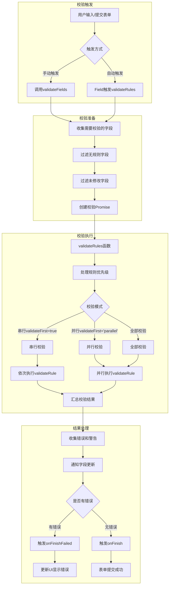

# antd表单专题之表单校验机制详细分析

表单校验是表单库中最核心的功能之一，它确保用户输入的数据符合预定义的规则和格式。本文将深入分析`field-form`库中的表单校验机制实现。

## 1. 校验系统概述

`field-form`的校验系统主要由以下几个部分组成：

1. **校验规则定义**：在Field组件上定义的rules属性
2. **校验触发机制**：通过validateTrigger控制何时触发校验
3. **校验执行引擎**：由validateUtil.ts中的函数处理具体校验逻辑
4. **校验结果处理**：收集和处理校验结果，更新UI和状态

整个校验流程采用Promise异步处理，支持同步和异步校验规则，并提供了丰富的校验选项。

## 2. 校验流程图



## 3. 校验规则系统

### 3.1 规则类型定义

`field-form`支持多种类型的校验规则，主要定义在`interface.ts`中：

```typescript
export type RuleType =
  | 'string'
  | 'number'
  | 'boolean'
  | 'method'
  | 'regexp'
  | 'integer'
  | 'float'
  | 'object'
  | 'enum'
  | 'date'
  | 'url'
  | 'hex'
  | 'email';

type Validator = (
  rule: RuleObject,
  value: StoreValue,
  callback: (error?: string) => void,
) => Promise<void | any> | void;

export interface ValidatorRule {
  warningOnly?: boolean;
  message?: string | ReactElement;
  validator: Validator;
}

interface BaseRule {
  warningOnly?: boolean;
  enum?: StoreValue[];
  len?: number;
  max?: number;
  message?: string | ReactElement;
  min?: number;
  pattern?: RegExp;
  required?: boolean;
  transform?: (value: StoreValue) => StoreValue;
  type?: RuleType;
  whitespace?: boolean;
  validateTrigger?: string | string[];
}

type AggregationRule = BaseRule & Partial<ValidatorRule>;

interface ArrayRule extends Omit<AggregationRule, 'type'> {
  type: 'array';
  defaultField?: RuleObject;
}

export type RuleObject = AggregationRule | ArrayRule;
export type Rule = RuleObject | RuleRender;
```

### 3.2 规则优先级

校验规则按照以下优先级执行：

1. 非警告规则（`warningOnly: false`或未设置）优先于警告规则（`warningOnly: true`）
2. 按照规则定义的顺序执行

```typescript
// 规则排序
filledRules.sort(({ warningOnly: w1, ruleIndex: i1 }, { warningOnly: w2, ruleIndex: i2 }) => {
  if (!!w1 === !!w2) {
    // 保持原始顺序
    return i1 - i2;
  }

  if (w1) {
    return 1; // 警告规则排后
  }

  return -1; // 非警告规则排前
});
```

## 4. 校验执行机制

### 4.1 validateFields 方法

`validateFields`是表单校验的入口方法，它收集所有需要校验的字段，并创建校验Promise：

```typescript
private validateFields: InternalValidateFields = (arg1?: any, arg2?: any) => {
  // 参数处理
  let nameList: NamePath[];
  let options: InternalValidateOptions;
  
  // 确定要校验的字段列表
  const provideNameList = !!nameList;
  const namePathList: InternalNamePath[] | undefined = provideNameList
    ? nameList.map(getNamePath)
    : [];
  
  // 收集校验Promise
  const promiseList: Promise<FieldError>[] = [];
  
  this.getFieldEntities(true).forEach((field: FieldEntity) => {
    // 跳过无规则字段
    if (!field.props.rules || !field.props.rules.length) {
      return;
    }
    
    // 跳过未修改字段(如果设置了dirty)
    if (dirty && !field.isFieldDirty()) {
      return;
    }
    
    const fieldNamePath = field.getNamePath();
    
    // 添加字段校验Promise
    if (!provideNameList || containsNamePath(namePathList, fieldNamePath, recursive)) {
      const promise = field.validateRules({
        validateMessages: {
          ...defaultValidateMessages,
          ...this.validateMessages,
        },
        ...options,
      });
      
      promiseList.push(
        promise
          .then(() => ({ name: fieldNamePath, errors: [], warnings: [] }))
          .catch((ruleErrors: RuleError[]) => {
            // 处理错误和警告
            // ...
          })
      );
    }
  });
  
  // 合并所有校验结果
  const summaryPromise = allPromiseFinish(promiseList);
  this.lastValidatePromise = summaryPromise;
  
  // 处理校验结果
  // ...
  
  return returnPromise as Promise<Store>;
};
```

### 4.2 validateRules 函数

`validateRules`函数是校验执行的核心，它处理字段的校验规则并返回校验结果：

```typescript
export function validateRules(
  namePath: InternalNamePath,
  value: StoreValue,
  rules: RuleObject[],
  options: InternalValidateOptions,
  validateFirst: boolean | 'parallel',
  messageVariables?: Record<string, string>,
) {
  const name = namePath.join('.');
  
  // 填充规则上下文
  const filledRules: RuleObject[] = rules
    .map((currentRule, ruleIndex) => {
      // 处理validator函数
      // ...
      return cloneRule;
    })
    .sort(/* 规则排序 */);
  
  // 执行校验规则
  let summaryPromise: Promise<RuleError[]>;
  
  if (validateFirst === true) {
    // 串行校验，遇到错误立即返回
    summaryPromise = new Promise(async (resolve, reject) => {
      for (let i = 0; i < filledRules.length; i += 1) {
        const rule = filledRules[i];
        const errors = await validateRule(name, value, rule, options, messageVariables);
        if (errors.length) {
          reject([{ errors, rule }]);
          return;
        }
      }
      resolve([]);
    });
  } else {
    // 并行校验
    const rulePromises: Promise<RuleError>[] = filledRules.map(rule =>
      validateRule(name, value, rule, options, messageVariables).then(errors => ({ errors, rule })),
    );
    
    summaryPromise = (
      validateFirst ? finishOnFirstFailed(rulePromises) : finishOnAllFailed(rulePromises)
    ).then((errors: RuleError[]): RuleError[] | Promise<RuleError[]> => {
      return Promise.reject<RuleError[]>(errors);
    });
  }
  
  return summaryPromise;
}
```

### 4.3 validateRule 函数

`validateRule`函数处理单个校验规则的执行：

```typescript
async function validateRule(
  name: string,
  value: StoreValue,
  rule: RuleObject,
  options: InternalValidateOptions,
  messageVariables?: Record<string, string>,
): Promise<string[]> {
  const cloneRule = { ...rule };
  
  // 特殊处理validator函数
  if (cloneRule.validator) {
    // ...
  }
  
  // 特殊处理数组校验
  let subRuleField: RuleObject = null;
  if (cloneRule && cloneRule.type === 'array' && cloneRule.defaultField) {
    subRuleField = cloneRule.defaultField;
    delete cloneRule.defaultField;
  }
  
  // 创建校验器
  const validator = new AsyncValidator({
    [name]: [cloneRule],
  });
  
  // 设置校验消息
  const messages = merge(defaultValidateMessages, options.validateMessages);
  validator.messages(messages);
  
  let result = [];
  
  // 执行校验
  try {
    await Promise.resolve(validator.validate({ [name]: value }, { ...options }));
  } catch (errObj) {
    if (errObj.errors) {
      result = errObj.errors.map(({ message }, index: number) => {
        const mergedMessage = message === CODE_LOGIC_ERROR ? messages.default : message;
        return mergedMessage;
      });
    }
  }
  
  // 处理数组校验
  if (!result.length && subRuleField) {
    const subResults: string[][] = await Promise.all(
      (value as StoreValue[]).map((subValue: StoreValue, i: number) =>
        validateRule(`${name}.${i}`, subValue, subRuleField, options, messageVariables),
      ),
    );
    
    return subResults.reduce((prev, errors) => [...prev, ...errors], []);
  }
  
  // 替换消息变量
  return result.map(error => {
    if (typeof error === 'string') {
      return replaceMessage(error, kv);
    }
    return error;
  });
}
```

## 5. 校验模式

`field-form`支持三种校验模式：

### 5.1 串行校验（validateFirst = true）

串行校验会按顺序执行规则，一旦遇到错误立即停止后续规则的校验：

```typescript
// 串行校验
summaryPromise = new Promise(async (resolve, reject) => {
  for (let i = 0; i < filledRules.length; i += 1) {
    const rule = filledRules[i];
    const errors = await validateRule(name, value, rule, options, messageVariables);
    if (errors.length) {
      reject([{ errors, rule }]);
      return;
    }
  }
  resolve([]);
});
```

### 5.2 并行校验（validateFirst = 'parallel'）

并行校验会同时执行所有规则，但在遇到第一个错误时立即返回：

```typescript
// 并行校验但遇到第一个错误立即返回
async function finishOnFirstFailed(rulePromises: Promise<RuleError>[]): Promise<RuleError[]> {
  let count = 0;
  
  return new Promise(resolve => {
    rulePromises.forEach(promise => {
      promise.then(ruleError => {
        if (ruleError.errors.length) {
          resolve([ruleError]);
        }
        
        count += 1;
        if (count === rulePromises.length) {
          resolve([]);
        }
      });
    });
  });
}
```

### 5.3 全部校验（validateFirst = false）

全部校验会执行所有规则，并收集所有错误：

```typescript
// 执行所有规则并收集所有错误
async function finishOnAllFailed(rulePromises: Promise<RuleError>[]): Promise<RuleError[]> {
  return Promise.all(rulePromises).then(
    (errorsList: RuleError[]): RuleError[] | Promise<RuleError[]> => {
      const errors: RuleError[] = [].concat(...errorsList);
      return errors;
    },
  );
}
```

## 6. 校验触发机制

校验可以通过多种方式触发：

### 6.1 手动触发

通过调用表单实例的`validateFields`方法手动触发校验：

```typescript
form.validateFields().then(values => {
  // 校验成功
}).catch(errorInfo => {
  // 校验失败
});
```

### 6.2 自动触发

通过`validateTrigger`配置自动触发校验的时机：

```jsx
<Field
  name="username"
  rules={[{ required: true }]}
  validateTrigger={['onChange', 'onBlur']}
>
  {/* ... */}
</Field>
```

Field组件内部会监听这些事件并调用`dispatch`方法触发校验：

```typescript
private dispatch = (action: ReducerAction) => {
  switch (action.type) {
    case 'validateField': {
      const { namePath, triggerName } = action;
      this.validateFields([namePath], { triggerName });
      break;
    }
    // ...
  }
};
```

## 7. 校验结果处理

校验结果处理包括以下几个步骤：

### 7.1 错误和警告分离

```typescript
ruleErrors.forEach?.(({ rule: { warningOnly }, errors }) => {
  if (warningOnly) {
    mergedWarnings.push(...errors);
  } else {
    mergedErrors.push(...errors);
  }
});
```

### 7.2 通知观察者

```typescript
summaryPromise
  .catch(results => results)
  .then((results: FieldError[]) => {
    const resultNamePathList: InternalNamePath[] = results.map(({ name }) => name);
    this.notifyObservers(this.store, resultNamePathList, {
      type: 'validateFinish',
    });
    this.triggerOnFieldsChange(resultNamePathList, results);
  });
```

### 7.3 触发回调函数

```typescript
// 成功回调
if (onFinish) {
  try {
    onFinish(values);
  } catch (err) {
    console.error(err);
  }
}

// 失败回调
if (onFinishFailed) {
  onFinishFailed(e);
}
```

## 8. 自定义校验器

`field-form`支持自定义校验器，有两种实现方式：

### 8.1 回调方式（已废弃）

```jsx
<Field
  name="username"
  rules={[{
    validator: (rule, value, callback) => {
      if (value === 'admin') {
        callback('用户名不能为admin');
      } else {
        callback();
      }
    }
  }]}
>
  {/* ... */}
</Field>
```

### 8.2 Promise方式（推荐）

```jsx
<Field
  name="username"
  rules={[{
    validator: async (rule, value) => {
      if (value === 'admin') {
        throw new Error('用户名不能为admin');
      }
    }
  }]}
>
  {/* ... */}
</Field>
```

## 9. 校验消息定制

校验消息可以通过多种方式定制：

### 9.1 规则级别定制

```jsx
<Field
  name="username"
  rules={[{
    required: true,
    message: '请输入用户名'
  }]}
>
  {/* ... */}
</Field>
```

### 9.2 表单级别定制

```jsx
<Form
  validateMessages={{
    required: '${name}是必填字段',
    types: {
      email: '${name}不是有效的邮箱地址'
    }
  }}
>
  {/* ... */}
</Form>
```

### 9.3 全局定制

```typescript
// 默认校验消息
export const defaultValidateMessages = {
  default: 'Field validation error',
  required: '${name} is required',
  enum: '${name} must be one of [${enum}]',
  whitespace: '${name} cannot be empty',
  // ...
};
```

## 10. 校验性能优化

`field-form`实现了多种校验性能优化策略：

### 10.1 按需校验

只校验指定字段或有规则的字段：

```typescript
// 跳过无规则字段
if (!field.props.rules || !field.props.rules.length) {
  return;
}
```

### 10.2 脏数据校验

只校验已修改的字段：

```typescript
// 跳过未修改字段
if (dirty && !field.isFieldDirty()) {
  return;
}
```

### 10.3 批量处理

使用批处理机制合并多次校验操作：

```typescript
private batch = (key: string, callback: VoidFunction) => {
  this.batchUpdate(key, callback);
};
```

## 11. 校验系统与其他模块的交互

校验系统与表单其他模块有紧密的交互：

### 11.1 与状态管理的交互

校验结果会更新字段的状态：

```typescript
// 更新字段状态
field.errors = cache.get(field.name) || field.errors;
```

### 11.2 与依赖系统的交互

字段值变化会触发依赖字段的校验：

```typescript
// 触发依赖字段校验
const childrenFields = this.triggerDependenciesUpdate(prevStore, namePath);
```

### 11.3 与提交流程的交互

表单提交会先触发校验：

```typescript
private submit = () => {
  this.validateFields()
    .then(values => {
      // 校验成功，触发onFinish
    })
    .catch(e => {
      // 校验失败，触发onFinishFailed
    });
};
```

## 12. 校验系统详细时序图

```mermaid
sequenceDiagram
    participant User
    participant Form
    participant FormStore
    participant Field
    participant ValidateUtil
    participant AsyncValidator
    
    User->>Form: 提交表单
    Form->>FormStore: submit()
    FormStore->>FormStore: validateFields()
    
    FormStore->>Field: 收集需要校验的字段
    Field-->>FormStore: 返回字段实体
    
    FormStore->>Field: validateRules()
    Field->>ValidateUtil: validateRules()
    
    ValidateUtil->>ValidateUtil: 处理规则优先级
    
    alt validateFirst = true
        ValidateUtil->>ValidateUtil: 串行校验
        loop 每个规则
            ValidateUtil->>ValidateUtil: validateRule()
            ValidateUtil->>AsyncValidator: validate()
            AsyncValidator-->>ValidateUtil: 返回校验结果
            
            alt 有错误
                ValidateUtil-->>Field: 返回第一个错误
                break
            end
        end
    else validateFirst = 'parallel'
        ValidateUtil->>ValidateUtil: 并行校验但返回第一个错误
        ValidateUtil->>AsyncValidator: 并行validate()
        AsyncValidator-->>ValidateUtil: 返回校验结果
        ValidateUtil->>ValidateUtil: finishOnFirstFailed()
    else 全部校验
        ValidateUtil->>ValidateUtil: 并行校验并收集所有错误
        ValidateUtil->>AsyncValidator: 并行validate()
        AsyncValidator-->>ValidateUtil: 返回校验结果
        ValidateUtil->>ValidateUtil: finishOnAllFailed()
    end
    
    ValidateUtil-->>Field: 返回校验结果
    Field-->>FormStore: 返回校验结果
    
    FormStore->>FormStore: 收集所有字段的校验结果
    FormStore->>FormStore: notifyObservers()
    
    alt 校验成功
        FormStore->>Form: 触发onFinish
        Form->>User: 显示成功状态
    else 校验失败
        FormStore->>Form: 触发onFinishFailed
        Form->>User: 显示错误信息
    end
```

## 总结

`field-form`的校验系统设计精巧，功能强大，具有以下特点：

1. **灵活的规则系统**：支持多种内置规则类型和自定义校验器
2. **多种校验模式**：支持串行、并行和全量校验
3. **异步校验支持**：基于Promise的异步校验机制
4. **性能优化**：按需校验、脏数据校验和批处理机制
5. **可定制的错误消息**：支持多级别的错误消息定制
6. **警告与错误分离**：支持非阻断式的警告信息

这些特性使得`field-form`能够应对各种复杂的表单校验场景，为用户提供良好的表单体验。
