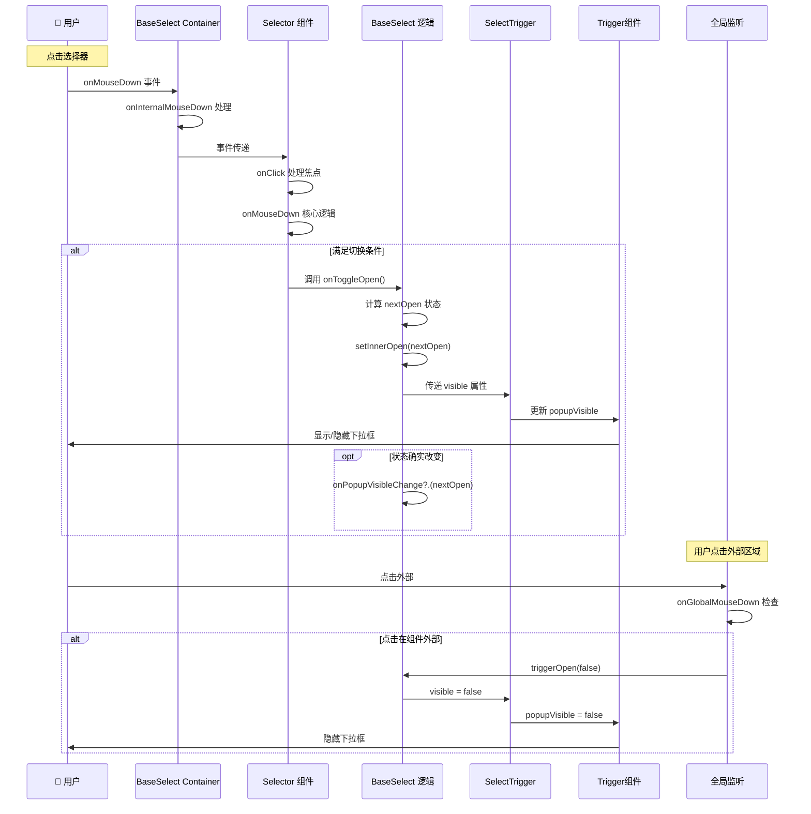

# Select 组件点击事件深度分析

> 基于 @rc-component/select 源码的点击事件处理机制完整解析

## 🎯 概述

Select 组件的点击事件处理是一个复杂的多层协作过程，涉及事件捕获、状态管理、UI 更新等多个环节。本文档将深入分析整个点击事件的处理流程。

## 🏗️ 事件处理架构

### 组件层级与职责

```
用户点击
    ↓
BaseSelect Container (onMouseDown)
    ↓  
Selector (onClick + onMouseDown)
    ↓
SingleSelector / MultipleSelector
    ↓
SelectTrigger (配置 Trigger)
    ↓
Trigger Component (外部库)
    ↓
弹窗显示/隐藏
```

## 📋 关键组件分析

### 1. Selector 组件 - 事件入口

**文件**: `src/Selector/index.tsx`

#### onClick 事件处理

```typescript
const onClick = ({ target }) => {
  if (target !== inputRef.current) {
    // 如果点击的不是输入框，则聚焦到输入框
    const isIE = (document.body.style as any).msTouchAction !== undefined;
    if (isIE) {
      setTimeout(() => {
        inputRef.current.focus();
      });
    } else {
      inputRef.current.focus();
    }
  }
};
```

**职责**:
- 确保点击选择器时输入框获得焦点
- 处理 IE 浏览器的兼容性问题

#### onMouseDown 事件处理 (核心逻辑)

```typescript
const onMouseDown: React.MouseEventHandler<HTMLElement> = (event) => {
  const inputMouseDown = getInputMouseDown();

  // 阻止默认行为的条件判断
  if (
    event.target !== inputRef.current &&
    !inputMouseDown &&
    !(mode === 'combobox' && disabled)
  ) {
    event.preventDefault();
  }

  // 核心切换逻辑
  if ((mode !== 'combobox' && (!showSearch || !inputMouseDown)) || !open) {
    if (open && autoClearSearchValue !== false) {
      onSearch('', true, false);  // 清空搜索值
    }
    onToggleOpen();  // 切换下拉状态
  }
};
```

**关键判断条件解析**:

1. **阻止默认行为的条件**:
   - `event.target !== inputRef.current`: 点击的不是输入框
   - `!inputMouseDown`: 输入框没有被按下
   - `!(mode === 'combobox' && disabled)`: 不是禁用的 combobox 模式

2. **触发切换的条件**:
   - **非 combobox 模式**: `mode !== 'combobox' && (!showSearch || !inputMouseDown)`
   - **或者当前关闭状态**: `!open`

### 2. BaseSelect 组件 - 状态管理

**文件**: `src/BaseSelect/index.tsx`

#### onToggleOpen 函数

```typescript
const onToggleOpen = React.useCallback(
  (newOpen?: boolean) => {
    const nextOpen = newOpen !== undefined ? newOpen : !mergedOpen;

    if (!disabled) {
      setInnerOpen(nextOpen);  // 更新内部状态

      if (mergedOpen !== nextOpen) {
        onPopupVisibleChange?.(nextOpen);  // 通知外部
      }
    }
  },
  [disabled, mergedOpen, setInnerOpen, onPopupVisibleChange],
);
```

**职责**:
- 计算下一个开关状态
- 更新内部状态 `setInnerOpen`
- 通知外部状态变化 `onPopupVisibleChange`

#### onInternalMouseDown 事件

```typescript
const onInternalMouseDown: React.MouseEventHandler<HTMLDivElement> = (event, ...restArgs) => {
  const { target } = event;
  const popupElement: HTMLDivElement = triggerRef.current?.getPopupElement();

  // 处理弹窗内点击的焦点管理
  if (popupElement && popupElement.contains(target as HTMLElement)) {
    const timeoutId = setTimeout(() => {
      // 清理逻辑...
      if (!mobile && !popupElement.contains(document.activeElement)) {
        selectorRef.current?.focus();  // 重新聚焦到选择器
      }
    });
  }

  onMouseDown?.(event, ...restArgs);  // 调用外部传入的 onMouseDown
};
```

**职责**:
- 处理弹窗内点击的焦点管理
- 确保在移动端和桌面端的正确行为

### 3. SelectTrigger 组件 - 弹窗控制

**文件**: `src/SelectTrigger.tsx`

```typescript
<Trigger
  {...restProps}
  showAction={onPopupVisibleChange ? ['click'] : []}
  hideAction={onPopupVisibleChange ? ['click'] : []}
  popupVisible={visible}
  onPopupVisibleChange={onPopupVisibleChange}
>
  {children}
</Trigger>
```

**关键配置**:
- `showAction=['click']`: 点击时显示弹窗
- `hideAction=['click']`: 点击时隐藏弹窗
- `popupVisible={visible}`: 控制弹窗显示状态
- `onPopupVisibleChange`: 状态变化回调

### 4. useSelectTriggerControl Hook - 外部点击处理

**文件**: `src/hooks/useSelectTriggerControl.ts`

```typescript
React.useEffect(() => {
  function onGlobalMouseDown(event: MouseEvent) {
    if (propsRef.current?.customizedTrigger) {
      return;  // 自定义触发器时跳过
    }

    let target = event.target as HTMLElement;

    // Shadow DOM 支持
    if (target.shadowRoot && event.composed) {
      target = (event.composedPath()[0] || target) as HTMLElement;
    }

    // 检查是否点击在组件外部
    if (
      propsRef.current.open &&
      elements()
        .filter((element) => element)
        .every((element) => !element.contains(target) && element !== target)
    ) {
      propsRef.current.triggerOpen(false);  // 关闭下拉框
    }
  }

  window.addEventListener('mousedown', onGlobalMouseDown);
  return () => window.removeEventListener('mousedown', onGlobalMouseDown);
}, []);
```

**职责**:
- 监听全局鼠标按下事件
- 判断点击是否在组件外部
- 支持 Shadow DOM
- 点击外部时关闭下拉框

## 🔄 完整事件流程

### 流程图



### 详细步骤

1. **事件捕获阶段**
   ```typescript
   // BaseSelect Container
   <div onMouseDown={onInternalMouseDown}>
     // Selector
     <div onClick={onClick} onMouseDown={onMouseDown}>
   ```

2. **条件判断阶段**
   ```typescript
   // 在 Selector 的 onMouseDown 中
   if ((mode !== 'combobox' && (!showSearch || !inputMouseDown)) || !open) {
     // 执行切换逻辑
   }
   ```

3. **状态更新阶段**
   ```typescript
   // 在 BaseSelect 的 onToggleOpen 中
   const nextOpen = newOpen !== undefined ? newOpen : !mergedOpen;
   setInnerOpen(nextOpen);
   ```

4. **UI 更新阶段**
   ```typescript
   // SelectTrigger 传递给 Trigger
   <Trigger popupVisible={visible} />
   ```

## 🎛️ 不同模式的行为差异

### 1. Single Mode (单选模式)

```typescript
// 条件: mode !== 'combobox' && (!showSearch || !inputMouseDown)
// 行为: 点击任何地方都会切换下拉状态
```

**特点**:
- 点击选择器区域即可切换
- 不区分是否点击输入框
- 选择选项后自动关闭

### 2. Multiple Mode (多选模式)

```typescript
// 条件: mode !== 'combobox' && (!showSearch || !inputMouseDown)  
// 行为: 与单选模式类似，但选择后不自动关闭
```

**特点**:
- 点击选择器区域切换
- 选择选项后保持打开状态
- 支持多个标签显示

### 3. Tags Mode (标签模式)

```typescript
// 条件: mode !== 'combobox' && (!showSearch || !inputMouseDown)
// 行为: 继承多选行为，额外支持输入创建
```

**特点**:
- 继承多选模式的点击行为
- 支持输入框输入创建新标签
- Enter 键或失焦时创建标签

### 4. Combobox Mode (下拉输入框模式)

```typescript
// 条件: !open (只有关闭时才切换)
// 行为: 更注重输入框交互
```

**特点**:
- 只有在关闭状态时点击才打开
- 输入框获得焦点时自动打开
- 输入内容会直接成为选中值

## 🔍 关键判断逻辑深度解析

### 核心判断条件

```typescript
if ((mode !== 'combobox' && (!showSearch || !inputMouseDown)) || !open) {
  onToggleOpen();
}
```

这个条件可以拆解为两部分：

#### 第一部分: `mode !== 'combobox' && (!showSearch || !inputMouseDown)`

**含义**: 非 combobox 模式下的点击判断

- **`mode !== 'combobox'`**: 不是下拉输入框模式
- **`!showSearch`**: 没有搜索功能时，任何点击都响应
- **`!inputMouseDown`**: 有搜索功能但没有点击输入框时响应

**逻辑分析**:
```typescript
// 情况1: 无搜索功能的单选/多选/标签模式
if (mode !== 'combobox' && !showSearch) {
  // 任何点击都切换状态
}

// 情况2: 有搜索功能但点击的不是输入框
if (mode !== 'combobox' && showSearch && !inputMouseDown) {
  // 点击选择器其他区域切换状态，点击输入框不切换
}
```

#### 第二部分: `!open`

**含义**: 当前处于关闭状态

- 无论什么模式，关闭状态下点击都会打开
- 这确保了用户始终能够打开下拉框

### 阻止默认行为的逻辑

```typescript
if (
  event.target !== inputRef.current &&
  !inputMouseDown &&
  !(mode === 'combobox' && disabled)
) {
  event.preventDefault();
}
```

**目的**: 防止不必要的默认浏览器行为

- **`event.target !== inputRef.current`**: 不是点击输入框
- **`!inputMouseDown`**: 输入框没有被按下
- **`!(mode === 'combobox' && disabled)`**: 不是禁用的 combobox

## 🛠️ 兼容性处理

### 1. IE 浏览器兼容

```typescript
const isIE = (document.body.style as any).msTouchAction !== undefined;
if (isIE) {
  setTimeout(() => {
    inputRef.current.focus();
  });
} else {
  inputRef.current.focus();
}
```

**问题**: IE 浏览器的焦点处理有时序问题
**解决**: 使用 setTimeout 延迟执行

### 2. Shadow DOM 支持

```typescript
if (target.shadowRoot && event.composed) {
  target = (event.composedPath()[0] || target) as HTMLElement;
}
```

**问题**: Shadow DOM 中的事件目标可能不准确
**解决**: 使用 `composedPath()` 获取真实目标

### 3. 移动端适配

```typescript
if (!mobile && !popupElement.contains(document.activeElement)) {
  selectorRef.current?.focus();
}
```

**问题**: 移动端的焦点行为与桌面端不同
**解决**: 根据设备类型采用不同策略

## 🎯 性能优化

### 1. 事件处理优化

```typescript
const onToggleOpen = React.useCallback(
  (newOpen?: boolean) => {
    // 逻辑...
  },
  [disabled, mergedOpen, setInnerOpen, onPopupVisibleChange],
);
```

**优化**: 使用 `useCallback` 缓存事件处理函数

### 2. 状态变化检查

```typescript
if (mergedOpen !== nextOpen) {
  onPopupVisibleChange?.(nextOpen);
}
```

**优化**: 只在状态真正改变时才触发回调

### 3. 延迟处理

```typescript
const timeoutId = setTimeout(() => {
  // 焦点管理逻辑
});
```

**优化**: 使用 setTimeout 避免同步执行带来的问题

## 🐛 常见问题与解决方案

### 1. 点击不响应

**可能原因**:
- 事件被其他元素拦截
- 条件判断不满足
- 组件处于禁用状态

**排查方法**:
```typescript
console.log('mode:', mode);
console.log('showSearch:', showSearch);  
console.log('inputMouseDown:', inputMouseDown);
console.log('open:', open);
console.log('disabled:', disabled);
```

### 2. 焦点问题

**可能原因**:
- 浏览器兼容性问题
- 移动端焦点行为差异
- Shadow DOM 影响

**解决方案**:
- 检查浏览器类型
- 使用适当的焦点策略
- 处理 Shadow DOM 事件

### 3. 外部点击无法关闭

**可能原因**:
- 全局事件监听器未正确设置
- 元素判断逻辑错误
- Shadow DOM 干扰

**解决方案**:
- 检查 `useSelectTriggerControl` 的元素数组
- 确认事件目标判断逻辑
- 处理 Shadow DOM 场景

## 📊 事件处理性能分析

### 事件触发频率

| 事件类型 | 触发频率 | 性能影响 |
|---------|---------|---------|
| onClick | 低 | 几乎无 |
| onMouseDown | 低 | 几乎无 |
| onGlobalMouseDown | 中 | 轻微 |
| onPopupVisibleChange | 低 | 轻微 |

### 优化建议

1. **减少不必要的重渲染**
   ```typescript
   const memoizedHandler = React.useCallback(handler, deps);
   ```

2. **批量状态更新**
   ```typescript
   React.unstable_batchedUpdates(() => {
     setInnerOpen(nextOpen);
     // 其他状态更新
   });
   ```

3. **事件委托**
   ```typescript
   // 使用全局事件监听器而不是每个元素单独监听
   ```

## 🔧 自定义扩展

### 1. 自定义点击行为

```typescript
const customOnMouseDown = (event) => {
  // 自定义逻辑
  if (customCondition) {
    return; // 阻止默认行为
  }
  
  // 调用原始处理函数
  originalOnMouseDown(event);
};
```

### 2. 添加额外的触发条件

```typescript
const enhancedCondition = (mode, showSearch, inputMouseDown, open, customFlag) => {
  const originalCondition = (mode !== 'combobox' && (!showSearch || !inputMouseDown)) || !open;
  return originalCondition && customFlag;
};
```

### 3. 自定义外部点击处理

```typescript
const useCustomTriggerControl = (elements, open, triggerOpen, customLogic) => {
  React.useEffect(() => {
    const handler = (event) => {
      if (customLogic(event)) {
        triggerOpen(false);
      }
    };
    
    window.addEventListener('mousedown', handler);
    return () => window.removeEventListener('mousedown', handler);
  }, []);
};
```

## 📝 总结

Select 组件的点击事件处理是一个精心设计的多层协作系统：

### 核心特点

1. **分层处理**: 不同层级负责不同职责
2. **模式适配**: 针对不同模式有不同的处理逻辑  
3. **兼容性**: 处理各种浏览器和设备差异
4. **性能优化**: 使用缓存和批量更新等优化手段

### 设计亮点

1. **清晰的职责分离**: 每个组件只处理自己的逻辑
2. **灵活的条件判断**: 复杂但准确的触发条件
3. **完善的边界处理**: 考虑各种边界情况和异常场景
4. **良好的扩展性**: 支持自定义和扩展

### 学习价值

这个点击事件处理系统展示了企业级组件库在处理复杂交互时的设计思路和实现技巧，是学习 React 组件设计的优秀范例。

---

**参考文件**:
- `src/Selector/index.tsx` - 主要事件处理逻辑
- `src/BaseSelect/index.tsx` - 状态管理和协调
- `src/SelectTrigger.tsx` - 弹窗控制配置  
- `src/hooks/useSelectTriggerControl.ts` - 外部点击处理

**创建时间**: $(date)
**版本**: @rc-component/select v1.1.4
