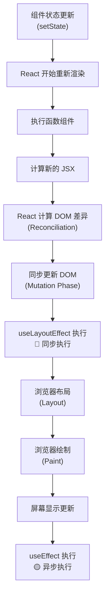
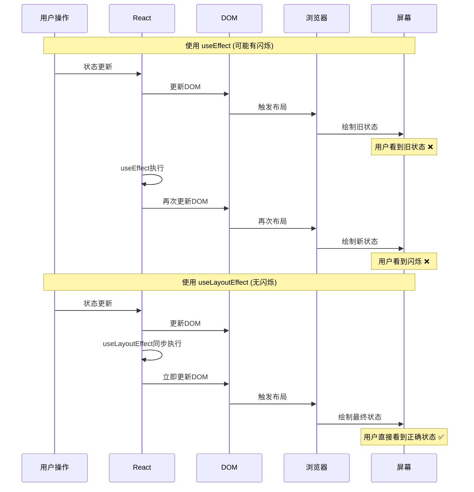
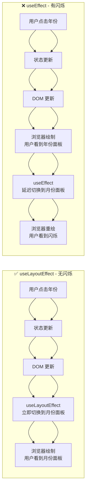
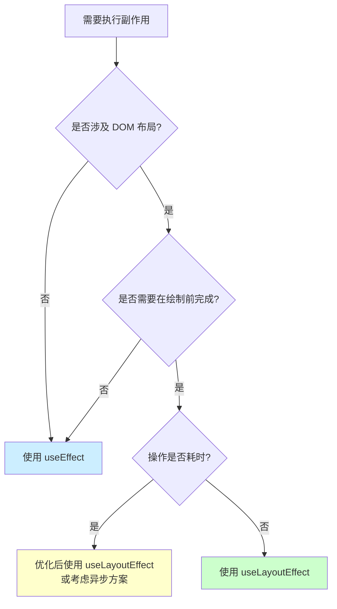

# 时间选择器组件体验优化之useLayoutEffect 深度解析：确保 DOM 更新时序的关键机制

## 目录

- [1. 概述](#1-概述)
- [2. React 渲染时序详解](#2-react-渲染时序详解)
- [3. useLayoutEffect vs useEffect](#3-uselayouteffect-vs-useeffect)
- [4. 实际应用场景分析](#4-实际应用场景分析)
- [5. 性能考量与最佳实践](#5-性能考量与最佳实践)
- [6. 常见问题与解决方案](#6-常见问题与解决方案)

## 1. 概述

`useLayoutEffect` 是 React 提供的一个特殊的 Effect Hook，它在 DOM 更新完成后、浏览器绘制之前**同步执行**。这个特性使得它成为确保 DOM 更新时序的关键工具。

### 1.1 核心特性

- ✅ **同步执行**：在 DOM 更新后立即执行，阻塞浏览器绘制
- ✅ **时序保证**：确保副作用在用户看到界面前完成
- ✅ **避免闪烁**：防止用户看到中间状态或不一致的 UI
- ⚠️ **性能影响**：会阻塞浏览器渲染，需要谨慎使用

## 2. React 渲染时序详解

### 2.1 完整的渲染流水线



### 2.2 关键时间点

| 阶段 | 描述 | Hook 执行 |
|------|------|-----------|
| **Render Phase** | 计算新的组件状态和 JSX | - |
| **Commit Phase** | 更新实际的 DOM | - |
| **Layout Phase** | **useLayoutEffect 执行** | `useLayoutEffect` |
| **Paint Phase** | 浏览器绘制到屏幕 | - |
| **Post-Paint** | 绘制完成后 | `useEffect` |

## 3. useLayoutEffect vs useEffect

### 3.1 执行时序对比



### 3.2 选择指南

| 场景 | 推荐使用 | 原因 |
|------|----------|------|
| DOM 测量和布局 | `useLayoutEffect` | 需要在绘制前获取准确的布局信息 |
| 滚动位置同步 | `useLayoutEffect` | 避免滚动跳跃和闪烁 |
| 避免视觉闪烁 | `useLayoutEffect` | 确保状态更新在绘制前完成 |
| 数据获取 | `useEffect` | 不影响布局，异步执行更好 |
| 事件监听器 | `useEffect` | 不需要阻塞渲染 |
| 副作用清理 | `useEffect` | 通常不需要同步执行 |

## 4. 实际应用场景分析

### 4.1 场景一：时间选择器滚动同步

**问题**：当时间值改变时，需要将滚动列表定位到对应的时间项。

```typescript
// ❌ 使用 useEffect - 会产生闪烁
useEffect(() => {
  syncScroll(); // 用户先看到旧位置，然后看到跳跃
}, [value]);

// ✅ 使用 useLayoutEffect - 无闪烁
useLayoutEffect(() => {
  syncScroll(); // 在绘制前同步滚动位置
  clearDelayCheck();

  return () => {
    stopScroll();
    clearDelayCheck();
  };
}, [value, optionalValue, units]);
```

**滚动同步的关键实现**：

```typescript
const syncScroll = () => {
  const ul = ulRef.current;
  if (ul) {
    // 查询目标元素 - 需要 DOM 已更新
    const targetLi = ul.querySelector(`[data-value="${value}"]`);
    const firstLi = ul.querySelector(`li`);
    
    if (targetLi && firstLi) {
      // 计算目标位置 - 需要准确的布局信息
      const targetTop = targetLi.offsetTop - firstLi.offsetTop;
      
      // 平滑滚动到目标位置
      ul.scrollTop = targetTop;
    }
  }
};
```

### 4.2 场景二：面板模式切换

**问题**：当用户在日期选择器中选择年份后，需要立即切换到月份面板。

```typescript
// 模式切换必须在绘制前完成
useLayoutEffect(() => {
  if (mergedOpen && activeIndex !== undefined) {
    // 立即切换到正确的面板模式
    triggerModeChange(null, picker, false);
  }
}, [mergedOpen, activeIndex, picker]);
```

**面板切换的视觉效果对比**：



### 4.3 场景三：弹窗状态同步

**问题**：当弹窗关闭时，需要立即处理确认逻辑，确保状态一致性。

```typescript
useLayoutEffect(() => {
  const lastOp = lastOperation();

  // 弹窗关闭时的处理逻辑
  if (!mergedOpen && lastOp === 'input') {
    triggerOpen(false);
    triggerConfirm(); // 必须在下次渲染前确认
  }

  // 复杂选择器的提交逻辑
  if (!mergedOpen && complexPicker && !needConfirm && lastOp === 'panel') {
    triggerConfirm(); // 确保状态同步
  }
}, [mergedOpen]);
```

### 4.4 场景四：DOM 测量和计算

```typescript
const [dimensions, setDimensions] = useState({ width: 0, height: 0 });

useLayoutEffect(() => {
  if (elementRef.current) {
    // 测量 DOM 元素 - 需要在绘制前获取准确尺寸
    const rect = elementRef.current.getBoundingClientRect();
    setDimensions({
      width: rect.width,
      height: rect.height
    });
  }
}, [someProps]);
```

## 5. 性能考量与最佳实践

### 5.1 性能影响

```typescript
// ❌ 避免在 useLayoutEffect 中执行耗时操作
useLayoutEffect(() => {
  // 这会阻塞浏览器渲染！
  for (let i = 0; i < 1000000; i++) {
    // 耗时计算
  }
}, []);

// ✅ 将耗时操作移到 useEffect
useLayoutEffect(() => {
  // 只做必要的同步 DOM 操作
  element.scrollTop = targetPosition;
}, []);

useEffect(() => {
  // 耗时操作放在异步执行
  performHeavyCalculation();
}, []);
```

### 5.2 最佳实践

#### 5.2.1 明确使用场景

```typescript
// ✅ 需要同步 DOM 操作
useLayoutEffect(() => {
  // DOM 测量
  // 滚动位置同步  
  // 避免闪烁的状态更新
}, []);

// ✅ 不需要同步的操作
useEffect(() => {
  // 数据获取
  // 事件监听
  // 日志记录
}, []);
```

#### 5.2.2 优化执行频率

```typescript
// ❌ 频繁执行 useLayoutEffect
useLayoutEffect(() => {
  updateLayout();
}, [mousePosition]); // 鼠标移动时频繁触发

// ✅ 使用防抖或节流
const debouncedPosition = useDebounce(mousePosition, 16); // 60fps
useLayoutEffect(() => {
  updateLayout();
}, [debouncedPosition]);
```

#### 5.2.3 条件执行

```typescript
useLayoutEffect(() => {
  // 只在必要时执行
  if (shouldUpdateLayout) {
    updateLayout();
  }
}, [shouldUpdateLayout, otherDeps]);
```

## 6. 常见问题与解决方案

### 6.1 问题：useLayoutEffect 导致性能问题

**症状**：页面卡顿，渲染变慢

**解决方案**：
```typescript
// 分离同步和异步操作
useLayoutEffect(() => {
  // 只做必要的同步操作
  element.style.transform = `translateX(${position}px)`;
}, [position]);

useEffect(() => {
  // 异步操作
  analyticsTrack('position_changed', position);
}, [position]);
```

### 6.2 问题：服务端渲染 (SSR) 警告

**症状**：控制台出现 `useLayoutEffect does nothing on the server` 警告

**解决方案**：
```typescript
import { useLayoutEffect, useEffect } from 'react';

// 创建同构的 useLayoutEffect
const useIsomorphicLayoutEffect = 
  typeof window !== 'undefined' ? useLayoutEffect : useEffect;

// 使用
useIsomorphicLayoutEffect(() => {
  // 布局相关操作
}, []);
```

### 6.3 问题：测试环境中的问题

**解决方案**：
```typescript
// 在测试中模拟 useLayoutEffect
jest.mock('react', () => ({
  ...jest.requireActual('react'),
  useLayoutEffect: jest.requireActual('react').useEffect,
}));
```

### 6.4 问题：依赖数组优化

```typescript
// ❌ 依赖过多导致频繁执行
useLayoutEffect(() => {
  updateLayout();
}, [prop1, prop2, prop3, prop4]);

// ✅ 使用 useMemo 优化依赖
const layoutDeps = useMemo(() => 
  ({ prop1, prop2, prop3, prop4 }), 
  [prop1, prop2, prop3, prop4]
);

useLayoutEffect(() => {
  updateLayout();
}, [layoutDeps]);
```

## 7. 总结

### 7.1 核心要点

1. **时序保证**：`useLayoutEffect` 在 DOM 更新后、浏览器绘制前同步执行
2. **避免闪烁**：确保关键的 DOM 操作在用户看到界面前完成
3. **性能权衡**：提供完美视觉体验的同时会阻塞渲染
4. **明确场景**：只在需要同步 DOM 操作时使用

### 7.2 决策流程



### 7.3 最后的建议

- **默认选择 useEffect**：除非有明确的同步需求
- **谨慎使用 useLayoutEffect**：确保理解其性能影响
- **持续监控性能**：使用浏览器开发工具检查渲染性能
- **渐进式优化**：先实现功能，再根据实际需要优化时序

通过正确使用 `useLayoutEffect`，我们可以创建出既高性能又具有完美视觉体验的 React 应用。
