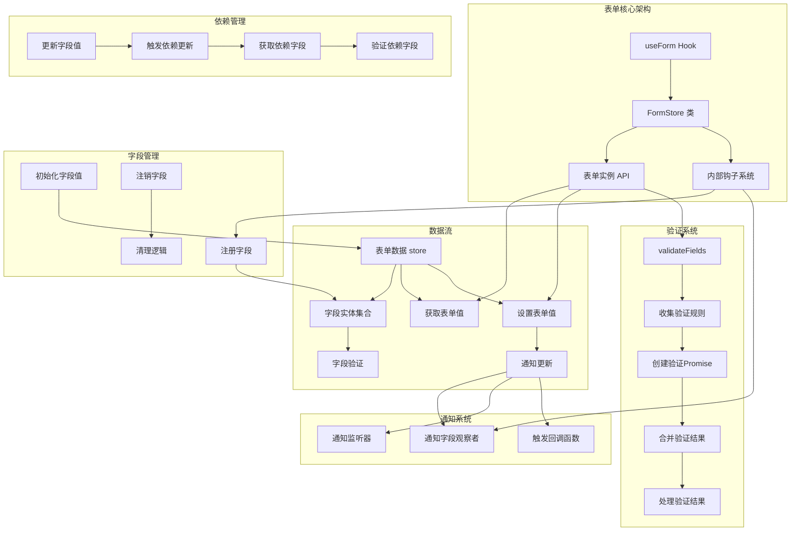
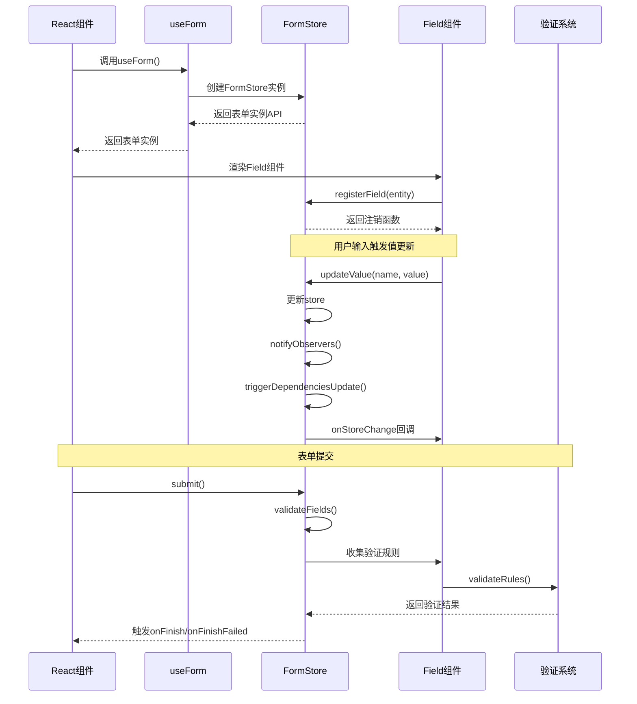
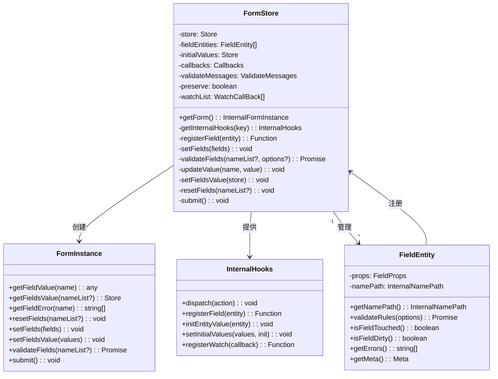

# useForm源码分析
react form表单在中后台项目中被大量使用，其源码的实现方式值得我们学习。我们先从useForm入手，分析其源码的实现方式。

## 1. 核心结构和设计模式

`useForm`是一个自定义React Hook，采用了类与函数式结合的设计模式。核心是通过`FormStore`类管理表单状态，然后通过Hook API暴露给React组件。

```javascript
function useForm<Values = any>(form?: FormInstance<Values>): [FormInstance<Values>] {
  const formRef = React.useRef<FormInstance>(null);
  const [, forceUpdate] = React.useState({});

  if (!formRef.current) {
    if (form) {
      formRef.current = form;
    } else {
      const forceReRender = () => {
        forceUpdate({});
      };
      const formStore: FormStore = new FormStore(forceReRender);
      formRef.current = formStore.getForm();
    }
  }

  return [formRef.current];
}
```

设计特点：
- 使用单例模式确保组件生命周期内只创建一次表单实例
- 支持外部传入表单实例或内部创建
- 通过`forceUpdate`触发组件重新渲染

## 2. 表单核心架构图



## 3. FormStore类实现

`FormStore`是整个表单状态管理的核心，采用了面向对象的设计：

### 核心状态：
```javascript
private store: Store = {};                    // 表单值存储
private fieldEntities: FieldEntity[] = [];    // 字段实体集合
private initialValues: Store = {};            // 初始值
private callbacks: Callbacks = {};            // 回调函数集合
private validateMessages: ValidateMessages = null; // 验证消息
private preserve?: boolean = null;            // 是否在销毁时保留值
```

### 公共接口：
通过`getForm()`方法暴露表单实例API：
```javascript
public getForm = (): InternalFormInstance => ({
  getFieldValue: this.getFieldValue,
  getFieldsValue: this.getFieldsValue,
  getFieldError: this.getFieldError,
  // ... 其他公共API
  _init: true,
  getInternalHooks: this.getInternalHooks,
});
```

### 内部钩子系统：
通过`getInternalHooks`方法暴露内部API，并使用`HOOK_MARK`标记防止误用：
```javascript
private getInternalHooks = (key: string): InternalHooks | null => {
  if (key === HOOK_MARK) {
    this.formHooked = true;
    return {
      dispatch: this.dispatch,
      registerField: this.registerField,
      // ... 其他内部API
    };
  }
  warning(false, '`getInternalHooks` is internal usage. Should not call directly.');
  return null;
};
```

## 4. 表单操作流程图



## 5. 字段管理机制

### 字段注册：
```javascript
private registerField = (entity: FieldEntity) => {
  this.fieldEntities.push(entity);
  // ... 初始值设置和通知
  
  // 返回注销函数
  return (isListField?: boolean, preserve?: boolean, subNamePath: InternalNamePath = []) => {
    this.fieldEntities = this.fieldEntities.filter(item => item !== entity);
    // ... 清理逻辑
  };
};
```

### 字段初始化：
```javascript
private initEntityValue = (entity: FieldEntity) => {
  const { initialValue } = entity.props;
  if (initialValue !== undefined) {
    const namePath = entity.getNamePath();
    const prevValue = getValue(this.store, namePath);
    if (prevValue === undefined) {
      this.updateStore(setValue(this.store, namePath, initialValue));
    }
  }
};
```

## 6. 类关系图



## 7. 表单验证流程

验证系统是表单库的核心功能之一：

```javascript
private validateFields: InternalValidateFields = (arg1?: any, arg2?: any) => {
  // 参数处理
  let nameList: NamePath[];
  let options: InternalValidateOptions;
  // ...

  // 收集验证Promise
  const promiseList: Promise<FieldError>[] = [];
  
  this.getFieldEntities(true).forEach((field: FieldEntity) => {
    // 跳过无规则字段
    if (!field.props.rules || !field.props.rules.length) {
      return;
    }
    
    // 跳过未修改字段(如果设置了dirty)
    if (dirty && !field.isFieldDirty()) {
      return;
    }
    
    // 添加验证Promise
    if (!provideNameList || containsNamePath(namePathList, fieldNamePath, recursive)) {
      const promise = field.validateRules({/*...*/});
      promiseList.push(promise.then().catch(/*...*/));
    }
  });
  
  // 合并所有验证结果
  const summaryPromise = allPromiseFinish(promiseList);
  this.lastValidatePromise = summaryPromise;
  
  // 处理验证结果
  const returnPromise = summaryPromise
    .then(/*成功处理*/)
    .catch(/*错误处理*/);
    
  return returnPromise as Promise<Store>;
};
```

## 8. 值管理机制

### 设置单个字段值：
```javascript
private updateValue = (name: NamePath, value: StoreValue) => {
  const namePath = getNamePath(name);
  const prevStore = this.store;
  this.updateStore(setValue(this.store, namePath, value));
  
  // 通知观察者
  this.notifyObservers(prevStore, [namePath], {
    type: 'valueUpdate',
    source: 'internal',
  });
  this.notifyWatch([namePath]);
  
  // 触发依赖更新
  const childrenFields = this.triggerDependenciesUpdate(prevStore, namePath);
  
  // 触发回调
  if (onValuesChange) {
    const changedValues = cloneByNamePathList(this.store, [namePath]);
    onValuesChange(changedValues, this.getFieldsValue());
  }
  
  this.triggerOnFieldsChange([namePath, ...childrenFields]);
};
```

### 设置多个字段值：
```javascript
private setFieldsValue = (store: Store) => {
  const prevStore = this.store;
  if (store) {
    const nextStore = merge(this.store, store);
    this.updateStore(nextStore);
  }
  
  this.notifyObservers(prevStore, null, {
    type: 'valueUpdate',
    source: 'external',
  });
  this.notifyWatch();
};
```

## 9. 观察者模式实现

### 通知观察者：
```javascript
private notifyObservers = (
  prevStore: Store,
  namePathList: InternalNamePath[] | null,
  info: NotifyInfo,
) => {
  if (this.subscribable) {
    const mergedInfo: ValuedNotifyInfo = {
      ...info,
      store: this.getFieldsValue(true),
    };
    this.getFieldEntities().forEach(({ onStoreChange }) => {
      onStoreChange(prevStore, namePathList, mergedInfo);
    });
  } else {
    this.forceRootUpdate();
  }
};
```

### 监听系统：
```javascript
private watchList: WatchCallBack[] = [];

private registerWatch: InternalHooks['registerWatch'] = callback => {
  this.watchList.push(callback);
  return () => {
    this.watchList = this.watchList.filter(fn => fn !== callback);
  };
};

private notifyWatch = (namePath: InternalNamePath[] = []) => {
  if (this.watchList.length) {
    const values = this.getFieldsValue();
    const allValues = this.getFieldsValue(true);
    this.watchList.forEach(callback => {
      callback(values, allValues, namePath);
    });
  }
};
```

## 10. 依赖管理系统

表单支持字段间的依赖关系，当一个字段更新时，可以触发依赖它的其他字段更新：

```javascript
private getDependencyChildrenFields = (rootNamePath: InternalNamePath): InternalNamePath[] => {
  const children: Set<FieldEntity> = new Set();
  const childrenFields: InternalNamePath[] = [];
  
  // 构建依赖映射
  const dependencies2fields: NameMap<Set<FieldEntity>> = new NameMap();
  this.getFieldEntities().forEach(field => {
    const { dependencies } = field.props;
    (dependencies || []).forEach(dependency => {
      const dependencyNamePath = getNamePath(dependency);
      dependencies2fields.update(dependencyNamePath, (fields = new Set()) => {
        fields.add(field);
        return fields;
      });
    });
  });
  
  // 递归填充依赖子字段
  const fillChildren = (namePath: InternalNamePath) => {
    const fields = dependencies2fields.get(namePath) || new Set();
    fields.forEach(field => {
      if (!children.has(field)) {
        children.add(field);
        const fieldNamePath = field.getNamePath();
        if (field.isFieldDirty() && fieldNamePath.length) {
          childrenFields.push(fieldNamePath);
          fillChildren(fieldNamePath);
        }
      }
    });
  };
  
  fillChildren(rootNamePath);
  return childrenFields;
};
```

## 11. 批处理机制

为了提高性能，表单使用批处理机制合并多个更新：

```javascript
private batchUpdate: BatchTask;

private setBatchUpdate = (batchUpdate: BatchTask) => {
  this.batchUpdate = batchUpdate;
};

private batch = (key: string, callback: VoidFunction) => {
  this.batchUpdate(key, callback);
};
```

## 12. 表单提交

表单提交逻辑封装在`submit`方法中：

```javascript
private submit = () => {
  this.warningUnhooked();

  this.validateFields()
    .then(values => {
      const { onFinish } = this.callbacks;
      if (onFinish) {
        try {
          onFinish(values);
        } catch (err) {
          console.error(err);
        }
      }
    })
    .catch(e => {
      const { onFinishFailed } = this.callbacks;
      if (onFinishFailed) {
        onFinishFailed(e);
      }
    });
};
```

## 总结

`useForm`源码采用了多种设计模式和技术：

1. **类与函数式结合**：使用类管理复杂状态，通过Hook提供React集成
2. **观察者模式**：通过通知系统实现组件间通信
3. **命令模式**：通过dispatch方法处理不同类型的操作
4. **依赖注入**：允许外部传入表单实例
5. **单例模式**：确保组件生命周期内只创建一次表单实例
6. **组合模式**：通过字段实体和表单实例的组合构建表单树
7. **策略模式**：支持多种验证策略和触发方式

这种设计使得表单库具有高度的灵活性和可扩展性，能够处理复杂的表单场景和需求。
